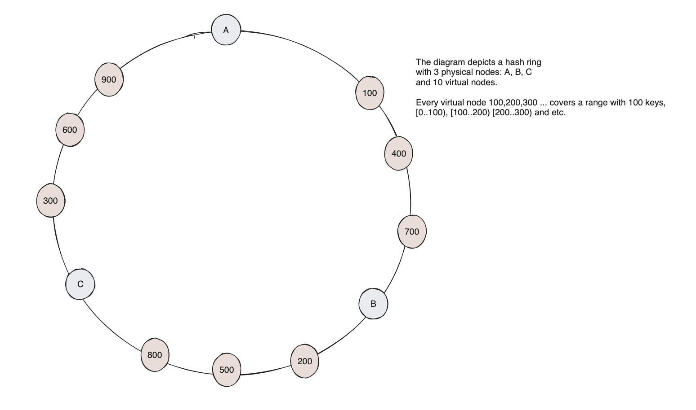

# consistent-hashing

## Description
This project provides a basic implementation of the consistent hashing algorithm. Consistent hashing is a fundamental technique used in distributed systems for assigning keys to nodes in a way that minimizes reassignment when nodes are added or removed from the system.

 
## Implementation details
- **Database Sharding**: The SQL database is sharded across three MySQL instances. Sharding distributes the data across multiple nodes, allowing for horizontal scalability and improved performance.
- **Hashing Algorithm**: The `md5` hashing algorithm is utilized to generate hash values for keys. `md5` produces a 128-bit hash value, which is suitable for mapping keys to physical database nodes.
- **Integer Mapping**: Each hash generated by `md5` is converted into a 128-bit integer, providing a consistent and uniform representation for mapping to physical DB nodes.
- **Hashing Ring Structure**: The hashing ring is constructed as a binary tree, where each node represents a range of keys. This structure facilitates efficient key lookup and node assignment.
- **Data Partitioning**: Data in the solution is partitioned based on a `timestamp`. 
- **Even Key Distribution**: To achieve even key distribution among available nodes, the algorithm leverages virtual nodes. Virtual nodes enable finer-grained distribution of keys across the hash ring, improving load balancing and system stability.

## Usage

## key takeaways:
- leveraging consistent hashing decreases the amount of data to shift/move in case a db node removed/added
- adding virtual nodes into hashing ring enhances data distribution
- the efficient way to representing a hashing ring is a binary tree
- when selecting by datetime range, a hash key should be calculated for every time period
